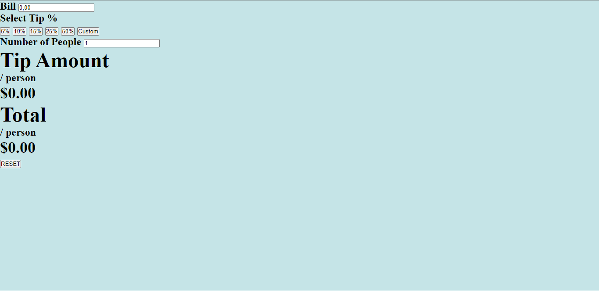

# tip-calculator-app

<!-- Screenshot -->

Built with HTML, CSS and JavaScript.

## Sumary

- [Overview](#overview)
    - [The Challenge](#the-challenge)
    - [Screenshot](#screenshot) -->
- [My Process](#my-process)
    - [Built With](#built-with)
    - [What I Learned](#what-i-learned)
- [Updates](#updates)
    - [1st Update](#1st-update)
    <!-- - [2nd Update](#2nd-update) -->
    <!-- - [3rd Update](#3rd-update) -->

## Overview

### The Challenge

- 
-

### Screenshot

<!--  -->

## My Process

### Built With

- HTML5
- CSS
- Javascript

### What I Learned

-
-
-

## Updates

### 1st Update
08/29/23

- Built the HTML

    

<!-- ### 2nd Update -->
<!-- 00/00/00 -->

<!-- - -->
<!-- - -->
<!-- - -->

<!-- 

    

 -->

<!-- ### 3rd Update -->
<!-- 00/00/00 -->

<!-- - -->
<!-- - -->
<!-- - -->

<!-- 

    

 -->

<!-- ### 4th Update -->
<!-- 00/00/00 -->

<!-- - -->
<!-- - -->
<!-- - -->

<!-- 

    

 -->

<!-- 
The project is finished!
 -->